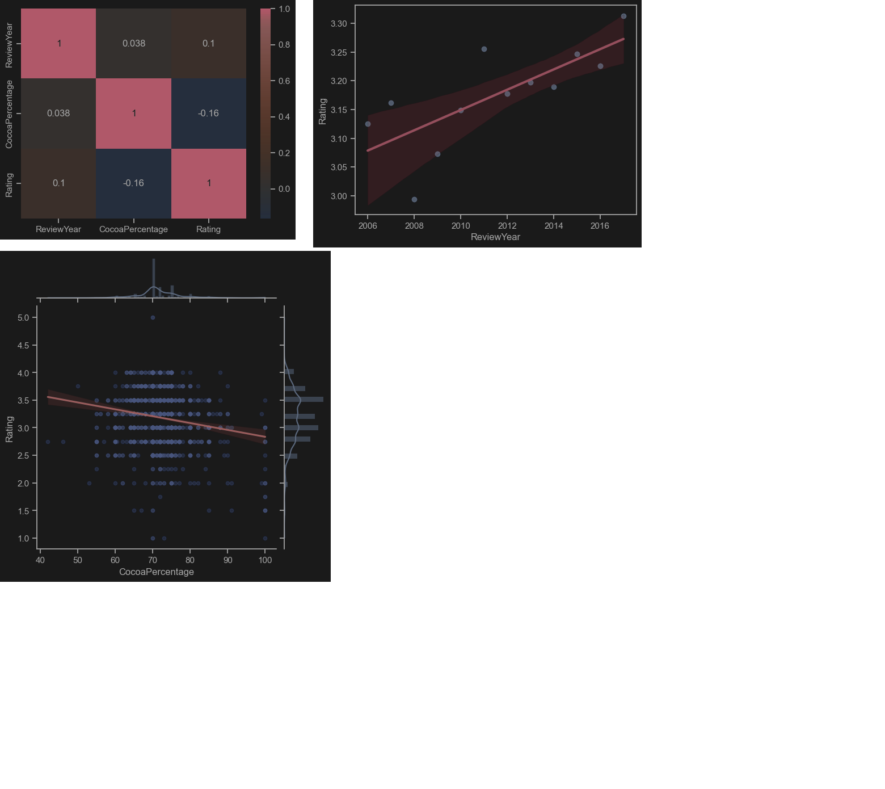

## Project overview
Task: To analyse influence of various factors, such as cocoa percentage, manufacturer country, etc. on customer ratings

Data sourse: flavors_of_cacao.csv

## Libraries used

Pandas: For working with dataframes

Seaborn: For graphs plotting

Matplotlib: For light edits of graph painted by seaborn

## Key Insights
* **Cocoa vs Rating:** The correlation is slightly negative ($-0.16$). Contrary to popular belief, 100% cocoa chocolate tends to get lower reviews. The "sweet spot" for high ratings is between **65% and 75%** cocoa.
* **Yearly Progress:** There is a weak positive correlation between years and ratings ($0.10$). This indicates a gradual improvement in chocolate quality or gradual decries in pickyness.
* **Best Beans:** The highest-rated beans consistently come from **Honduras, Guatemala, and Vietnam**.
* **Top Manufacturers:** Countries with the best manufacturing ratings are **Vietnam, Brazil, and Australia**.

## Pictures

